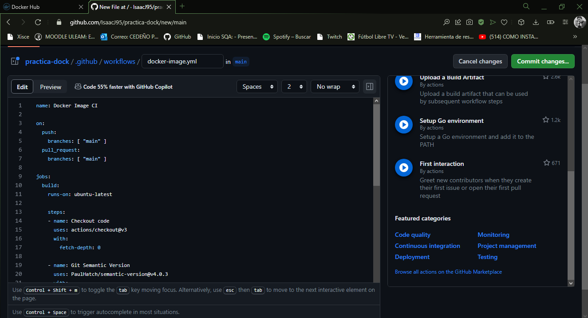

# Dockerización de Aplicación NestJS y GitHub Actions

## Descripción
Este repositorio demuestra cómo Dockerizar una aplicación NestJS y configurar un flujo de trabajo en GitHub Actions para construir y desplegar contenedores de Docker.

## Pasos por seguir

###  Crear Repositorio

Crea un repositorio público o privado en GitHub. [Enlace al Repositorio](https://github.com/IsaacJ95/practica-dock)

### Preparar el Código Fuente

Luego solo realizamos el commit del código a utilizar

###  Configurar Secrets en GitHub

Crea los secrets DOCKER_USER y DOCKER_PASSWORD en la sección de Secrets de tu repositorio en GitHub.

###  Configurar Token de Docker Hub

Utiliza tu usuario y clave (token) de Docker Hub para llenar los secrets DOCKER_USER y DOCKER_PASSWORD.
Crea un Token en Docker (con el nombre Github-Actions) y copia este Token generado en el secret DOCKER_PASSWORD.

####  Verificar Construcción y Funcionamiento

Asegúrate de que la imagen puede ser compilada con el siguiente comando:
bash
docker login
docker build -t joviric95/webhooks:latest .
Verifica el funcionamiento de la aplicación.

###  Crear Action Docker Image
Configura un flujo de trabajo en GitHub Actions para generar la imagen Docker utilizando el archivo docker-image.yml.

# Evidencias

Ya tenemos el actions creado para realizar builds automáticos.

